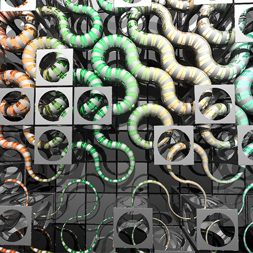

###


# Raymarched Truchet Tiles | WebGL Fragment shader Boilerplate

This is my basic WebGL2 & Frgament Shader boilerplate template. It's the bare minimum required to start developing webgl2 fragment shaders. Curious about what a shader is, then go here [Book Of Shaders](https://thebookofshaders.com/01/)!

The demo features a 3D ray marched truchet tile scene, mouse movment pans the scene around. Ray marching or path tracing uses mathmatics to formulate a 3D scenes and calculate the objects surfaces. This all happens on the GPU and in parallel, so it's quite fast and creates some pretty amazing real-time animations.



The concept of a truchet tile is pretty simple.

**_Truchet tiles are square tiles decorated with patterns that are not rotationally symmetric. When placed in a square tiling of the plane, they can form varied patterns, and the orientation of each tile can be used to visualize information associated with the tile's position within the tiling. [Wikipedia](https://en.wikipedia.org/wiki/Truchet_tiles)_**

## WebGL Bootstrap Code

`App.js` is the basic WebGL bootstrap, which sets up the canvas, shader uniforms and loads the shaders into the GPU for display. The `frg-shader` (Fragment shader) contains the meat of the graphics demo which is compiled and pushed to the GPU. the `vrt-shader` (Vertext shader) is a stage in the rendering pipeline that handles the processing of individual vertices. However we are just drawing on a the surface of a plane - so this will help us project our fragment shader to the canvas.

  

- WebGL2 boilterplate.
- [vertext shader] + [fragment shader] version 300 es.
- Query parameter resolution switching (?rez=1/2/3/4)

## Run the example

Check your browser [WebGL support](https://caniuse.com/webgl2).

Requires Node v12.xx.xx or greater

```bash
$ yarn install
$ yarn start
```

open http://localhost:2020/?rez=1 (1 to 4+ depending on systems)
